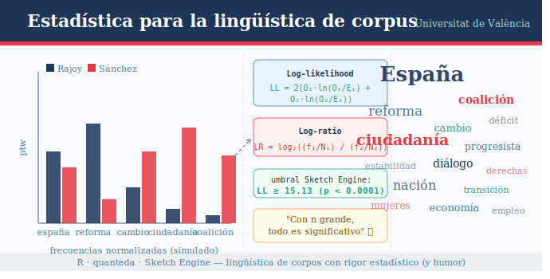

# Estadística para la lingüística de corpus



Profesor: Adrián Cabedo Nebot (adrian.cabedo@uv.es)
Catedrático de Lengua Española

Materiales para la sesión de formación (2 h) impartida en la **Universidad de Navarra**.

Los ejemplos parten de los **discursos de investidura de Rajoy (2011, 2016a, 2016b) y Sánchez (2020, 2023)** como corpus de trabajo para ilustrar los conceptos estadísticos más habituales en lingüística de corpus.

🌐 **Informe interactivo (GitHub Pages):** [ver ejemplo de análisis completo](https://acabedo.github.io/navarra2026/)

---

## Contenidos de la sesión

### Parte I — Fundamentos estadísticos

- ¿Por qué estadística en lingüística? El problema de distinguir patrones reales del azar
- Población y muestra: todos los discursos políticos españoles vs. nuestro corpus
- Tipos de variables: frecuencia léxica, longitud de frase, categoría gramatical…
- Hipótesis nula (H₀) e hipótesis alternativa: ¿usa Sánchez *cambio* más que Rajoy, o es casualidad?
- El valor *p*: qué mide exactamente, qué **no** mide, y por qué el umbral 0.05 es una convención
- Tamaño del efecto: por qué la significación estadística no equivale a relevancia lingüística

### Parte II — Estadística de valores habituales en plataformas como Sketch Engine

- **Frecuencia normalizada:** por qué no podemos comparar frecuencias brutas entre discursos de distinta longitud
- **Log-likelihood (LL):** contraste de hipótesis sobre diferencias de frecuencia entre corpus
- **Log-ratio:** una medida del tamaño del efecto — ¿cuántas veces más frecuente es una palabra en Sánchez que en Rajoy?
- **Simple Maths:** por qué difiere del log-ratio y cuándo preferir una u otra
- **Keyness:** identificación del léxico característico de cada corpus
- **Colocaciones:** patrones de co-ocurrencia estadísticamente relevantes

### Parte III — Replicación y aplicación en R

- De Sketch Engine a R: replicar manualmente los cálculos anteriores y comparar resultados
- Caso completo integrado: análisis de palabras clave en los cinco discursos — ¿qué léxico define ideológicamente cada corpus?
- Visualización de resultados: gráficos LL × log-ratio para interpretar el mapa léxico de los discursos

---

## Estructura del repositorio

```
├── index.html                       # Informe interactivo (GitHub Pages)
├── informe_corpus.qmd               # Código del informe interactivo (Quarto)
├── informe_corpus_files/            # Recursos generados por el informe
├── presentacion_Navarra2026.qmd     # Presentación principal (Quarto)
├── presentacion_Navarra2026.pdf     # Presentación en PDF
└── textos/                          # Discursos de investidura en texto plano
```

---

## Requisitos

### R y paquetes

```r
install.packages(c(
  "quanteda",
  "quanteda.textstats",
  "quanteda.textplots",
  "tidyverse",
  "ggplot2"
))
```

### Software adicional

- [R](https://cran.r-project.org/) ≥ 4.3
- [RStudio](https://posit.co/download/rstudio-desktop/) o [Positron](https://github.com/posit-dev/positron)
- [Quarto](https://quarto.org/) (para compilar los `.qmd`)

---

## Corpus

Los textos analizados son los discursos de investidura pronunciados en el Congreso de los Diputados:

| Orador | Año  | Resultado       |
|--------|------|-----------------|
| Rajoy  | 2011 | Investido       |
| Rajoy  | 2016a | No Investido       |
| Rajoy  | 2016b | Investido       |
| Sánchez| 2020 | Investido       |
| Sánchez| 2023 | Investido       |

Los textos proceden de fuentes públicas (Diario de Sesiones del Congreso de los Diputados).

## Licencia

Los materiales de esta sesión se distribuyen bajo licencia [CC BY 4.0](https://creativecommons.org/licenses/by/4.0/). Puedes reutilizarlos y adaptarlos citando la fuente.
